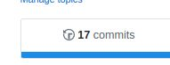
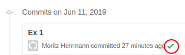

# Programmieren mit statistischer Software: Hausarbeit - Teil 1

## How to work with the Assignment:
1. Make sure you have all relevant packages installed:
```r
install.packages("tidyverse")
install.packages("forcats")
install.packages("nycflights13")
```

1. If not installed, install **git** (https://git-scm.com/downloads). Afterwards restart RStudio.

1. Download the Assignment Repository:
  `RStudio -> File -> New Project ->  Version Control -> git`
  Copy the URL for your assignment into the field **Repository URL**

1. If you are using RStudio open R-Project using the file: `test_assignment_***.Rproj` in the folder.

1. Solve the different exercises in the respective files inside the **R** folder!

1. **Tests for each function are activated as soon as you defined the function.
   If you want to run tests only for a single function, uncomment all other functions!**

1. Add the files, commit them and when you are ready push them to GitHub.

1. After a few minutes, travis checks should run! You can observe the results on the Github page of your repository:
 `commits -> green checkmark` (See screenshots).



 1. If you have successfully created all functions and the green checkmark appears, our tests successfully passed for each function!


## Build and check locally:

If you do not want to wait for Travis checks, you can build the package locally:
This also gives more verbose information into which checks run and which do not.

1. Install a few more packages:
```r
install.packages("devtools")
install.packages("checkmate")
install.packages("testthat")
```
1. If you are using RStudio open R-Project file: `test_assignment****.Rproj` in the folder.

1. Use `devtools::test()` and `devtools::check()`!
   Keyboard Shortcut for testing: `CTRL + SHIFT + T`

## Troubleshooting:

1. If building and checking locally does not work out of the box, you might have to install R-Tools (https://cran.r-project.org/bin/windows/Rtools/).


